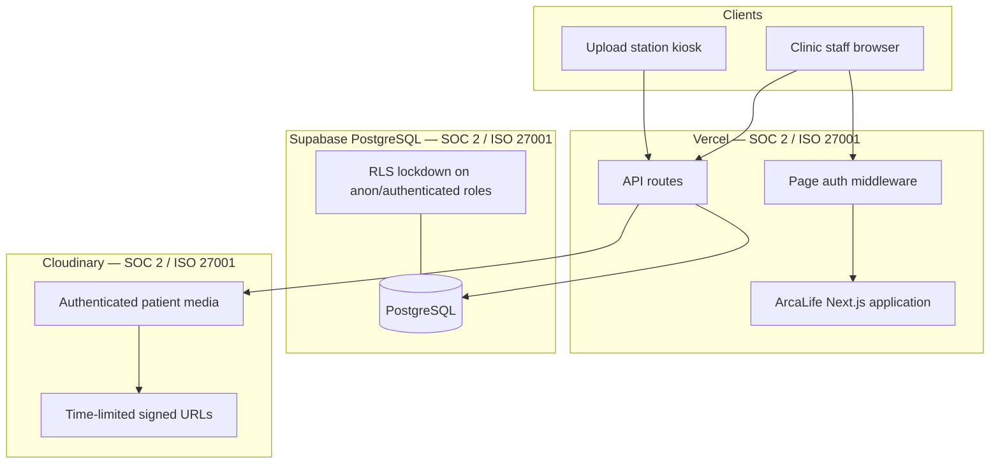

# ArcaLife Security & Compliance Status

**Document version:** 1.0  
**Last updated:** June 2026  
**Classification:** Customer-shareable  
**Audience:** Clinic procurement, legal, DPO, enterprise security reviewers

---

## Executive summary

ArcaLife is a multi-tenant clinic management platform for plastic surgery and aesthetic practices. It processes **personal data** and **special-category health data** (GDPR Article 9) including medical history, clinical images, treatment records, and Romanian national ID numbers (CNP).

Our security model combines three layers:

1. **Application controls** — authentication, role-based access, multi-tenant isolation, input validation, audit logging, and signed clinical media delivery
2. **Certified infrastructure** — Vercel (hosting), Supabase (PostgreSQL), and Cloudinary (clinical media) maintain independent SOC 2 Type II and ISO 27001 audits
3. **Operational practices** — documented incident response, GDPR procedures, vulnerability disclosure, and a transparent compliance roadmap

ArcaLife is built on SOC 2–certified infrastructure with **documented, self-assessed controls aligned with SOC 2 and GDPR**. An independent SOC 2 Type II audit of the ArcaLife product is in progress — see [Roadmap & transparency](#roadmap--transparency).

---

## Certification matrix

| Requirement | Type | Status | Evidence |
|-------------|------|--------|----------|
| TLS / HTTPS | Technical (mandatory) | **Implemented** | Vercel platform TLS; secure cookies |
| Vercel SOC 2 Type II + ISO 27001 | Vendor (inherited) | **Certified** | [security.vercel.com](https://security.vercel.com/) |
| Supabase SOC 2 Type II + ISO 27001 | Vendor (inherited) | **Certified** | [trust.supabase.io](https://trust.supabase.io/) |
| Cloudinary SOC 2 Type II + ISO 27001 | Vendor (inherited) | **Certified** | [cloudinary.com/trust](https://cloudinary.com/trust) |
| Sentry SOC 2 Type II | Vendor (inherited) | **Certified** | When error monitoring enabled |
| Encryption at rest | Platform | **Inherited** | Supabase + Cloudinary |
| Encryption in transit | Platform + app | **Implemented** | TLS + signed Cloudinary URLs |
| Authentication + RBAC | App control | **Implemented** | NextAuth JWT, bcrypt, org scoping |
| Signed clinical media | App control | **Implemented** | Authenticated Cloudinary assets |
| Supabase RLS lockdown | DB hardening | **Implemented** | Direct API access blocked |
| Rate limiting | App control | **Implemented** | Auth, register, upload-station |
| Security headers | App control | **Implemented** | HSTS, CSP (report-only), X-Frame-Options, nosniff |
| GDPR patient consent | Legal / product | **Implemented** | Digital intake + Romanian PDF forms |
| Subprocessor register | GDPR Art. 28 | **Implemented** | [vendor-compliance.md](vendor-compliance.md) |
| Privacy policy | GDPR Art. 13/14 | **Implemented** | `/ro/privacy` public page |
| RoPA (Art. 30) | Legal doc | **Implemented** | [docs/legal/ropa.md](../legal/ropa.md) |
| DPIA (Art. 35) | Legal doc | **Implemented** | [docs/legal/dpia.md](../legal/dpia.md) |
| DPA template | Legal contract | **Implemented** | [docs/legal/dpa-template.md](../legal/dpa-template.md) |
| Breach notification SOP | GDPR Art. 33/34 | **Implemented** | [docs/legal/breach-notification-sop.md](../legal/breach-notification-sop.md) |
| DSR workflow | GDPR Art. 15–17 | **Implemented** | Export/erasure APIs + [dsr-sop.md](../legal/dsr-sop.md) |
| Data retention policy | GDPR Art. 5 | **Implemented** | [retention-policy.md](../legal/retention-policy.md) + cron job |
| Audit logging | App control | **Implemented** | ActivityLog model + manager UI |
| MFA (privileged roles) | Enterprise control | **Implemented** | TOTP for MANAGER / ORGANIZATION_OWNER |
| SAST + dependency scanning | SOC 2 CC7.1 | **Implemented** | GitHub Actions CI |
| Incident response playbook | SOC 2 CC7.3 | **Implemented** | [docs/legal/incident-response.md](../legal/incident-response.md) |
| ISMS policy set | SOC 2 readiness | **Implemented** | [docs/legal/isms/](../legal/isms/) |
| Penetration test | Enterprise | **In progress** | [pentest-readiness.md](../legal/pentest-readiness.md) |
| ArcaLife SOC 2 Type II | Product certificate | **In progress** | [soc2-readiness.md](../legal/soc2-readiness.md) |
| ArcaLife ISO 27001 | Product certificate | **Planned** | Follows SOC 2 engagement |
| HIPAA (US market) | US optional | **Ready when needed** | [hipaa-readiness.md](../legal/hipaa-readiness.md) |

---

## Shared responsibility model

| Layer | ArcaLife responsibility | Vendor responsibility |
|-------|------------------------|----------------------|
| Application code | Access control, tenant isolation, validation | — |
| Secrets & config | Environment variables, PIN management | Platform secret storage |
| Patient consent | Intake forms, DSR handling | — |
| Physical / network security | — | Data centers, DDoS, patching |
| Encryption at rest | — | Database and media platform defaults |
| Platform audits | Provide application evidence | SOC 2 / ISO 27001 reports |

---

## Control highlights

| # | Control | Implementation |
|---|---------|----------------|
| 1 | Multi-tenant isolation | Every query scoped to `organizationId`; patient access verified in `src/lib/patient-access.ts` |
| 2 | Role-based access | `UserRole` enum; manager-only gates on users, logs, analytics |
| 3 | Password security | bcrypt cost factor 10; inactive/disabled accounts blocked at login |
| 4 | Clinical media protection | Cloudinary `type: authenticated` + server-signed URLs in `src/lib/cloudinary-patient-media.ts` |
| 5 | Database API lockdown | RLS enabled and forced; `anon`/`authenticated` roles revoked |
| 6 | Rate limiting | 20 requests / 15 minutes on auth, register, and upload-station endpoints |
| 7 | Security headers | HSTS, CSP report-only, X-Frame-Options, nosniff, Referrer-Policy |
| 8 | Audit trail | `ActivityLog` with IP, user agent, patient/appointment links |
| 9 | GDPR consent in product | Six Romanian legal forms in digital patient intake |
| 10 | PHI scrubbing in monitoring | Sentry `beforeSend` strips patient identifiers from error payloads |
| 11 | MFA for privileged roles | TOTP required for MANAGER and ORGANIZATION_OWNER accounts |
| 12 | Data subject rights | Patient export (`/api/patients/[id]/export`) and GDPR erasure (`/api/patients/[id]/erase`) |

Full technical detail: [application-controls.md](application-controls.md)

---

## GDPR compliance summary

| Article | Requirement | Status |
|---------|-------------|--------|
| Art. 5 | Data minimization, storage limitation | Implemented — retention policy + purge job |
| Art. 6 | Lawful basis | Implemented — consent + legitimate interest |
| Art. 7 | Conditions for consent | Implemented — intake consent forms |
| Art. 9 | Special category (health) data | Implemented — explicit consent in intake |
| Art. 13/14 | Information to data subjects | Implemented — privacy policy page |
| Art. 15 | Right of access | Implemented — patient export API |
| Art. 16 | Right to rectification | Implemented — clinic staff can edit records |
| Art. 17 | Right to erasure | Implemented — GDPR erasure API |
| Art. 25 | Data protection by design | Implemented — auth, RLS, signed media, MFA |
| Art. 28 | Processor obligations | Implemented — DPA template + subprocessor list |
| Art. 30 | Records of processing | Implemented — RoPA document |
| Art. 32 | Security of processing | Implemented — controls in this package |
| Art. 33/34 | Breach notification | Implemented — breach notification SOP |
| Art. 35 | DPIA | Implemented — DPIA document |
| Art. 44–49 | International transfers | Inherited — depends on vendor region config |

Full mapping: [control-matrix.md](control-matrix.md)

---

## Subprocessor register

| Subprocessor | Service | Certifications |
|--------------|---------|----------------|
| Vercel Inc. | Application hosting | SOC 2 Type II, ISO 27001:2022, PCI DSS SAQ-D |
| Supabase Inc. | PostgreSQL database | SOC 2 Type II, ISO 27001:2022, HIPAA-capable |
| Cloudinary Ltd. | Clinical media storage | SOC 2 Type II, ISO 27001 |
| Sentry (optional) | Error monitoring | SOC 2 Type II |

Details and trust-center links: [vendor-compliance.md](vendor-compliance.md)

---

## Roadmap & transparency

| Initiative | Target | Status |
|------------|--------|--------|
| SOC 2 Type II product audit | Q4 2026 | Observation period — see [soc2-readiness.md](../legal/soc2-readiness.md) |
| Annual penetration test | Q3 2026 | Vendor engagement in progress — see [pentest-readiness.md](../legal/pentest-readiness.md) |
| Distributed rate limiting (Redis) | Q3 2026 | Planned — Upstash Redis |
| DB RLS policies for Prisma role | Q4 2026 | Planned — defense in depth |
| HIPAA infrastructure (US clinics) | On first US customer | Ready — see [hipaa-readiness.md](../legal/hipaa-readiness.md) |
| CSP enforcement (from report-only) | After monitoring period | In progress |

We do **not** claim certifications we have not earned. Current accurate statements:

> ArcaLife is hosted on SOC 2 Type II and ISO 27001–certified infrastructure. Application-layer controls are documented and aligned with SOC 2 and GDPR requirements. A formal SOC 2 Type II product audit is underway.

---

## How to request audit artifacts

| Artifact | How to obtain |
|----------|---------------|
| Vercel SOC 2 / ISO reports | [security.vercel.com](https://security.vercel.com/) |
| Supabase SOC 2 / ISO reports | [trust.supabase.io/documents](https://trust.supabase.io/documents) (Team/Enterprise) |
| Cloudinary SOC 2 report | [cloudinary.com/trust](https://cloudinary.com/trust) |
| ArcaLife security overview | This document + [security-overview.md](security-overview.md) |
| ArcaLife control matrix | [control-matrix.md](control-matrix.md) |
| Data Processing Agreement | Contact security@arcalife.ro or your account representative |
| GDPR data subject requests | Clinic DPO or security@arcalife.ro |

---

## Related documents

| Document | Path |
|----------|------|
| Security overview | [security-overview.md](security-overview.md) |
| Application controls | [application-controls.md](application-controls.md) |
| Vendor compliance | [vendor-compliance.md](vendor-compliance.md) |
| Control matrix | [control-matrix.md](control-matrix.md) |
| Legal & GDPR packet | [docs/legal/](../legal/) |
| Vulnerability reporting | [SECURITY.md](../../SECURITY.md) |
