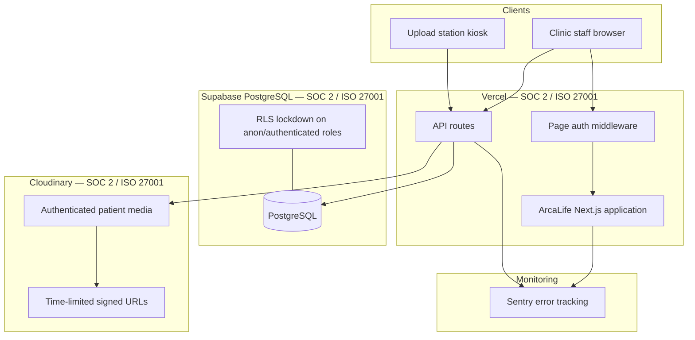

# ArcaLife Security Overview

**Document version:** 1.0  
**Last updated:** June 2026  
**Classification:** Customer-shareable

---

## Executive summary

ArcaLife is a multi-tenant clinic management platform used by healthcare organizations to manage patients, appointments, clinical records, and operational workflows. The platform processes **personal data** and **special categories of health data** under GDPR.

ArcaLife's security model combines:

1. **Application-layer controls** — authentication, authorization, input validation, and tenant isolation in code
2. **Certified infrastructure** — hosting (Vercel), database (Supabase PostgreSQL), and media storage (Cloudinary) from vendors with independent SOC 2 Type II and ISO 27001 audits
3. **Operational practices** — error monitoring (Sentry), uptime monitoring, and documented remote-support procedures

This document describes the security architecture. For vendor audit reports, see [vendor-compliance.md](vendor-compliance.md). For control-level detail, see [control-matrix.md](control-matrix.md).

---

## Architecture

---

## Data processed

| Category | Examples | Storage |
|----------|----------|---------|
| Identity & access | Staff email, name, role, hashed password | PostgreSQL (Supabase) |
| Patient demographics | Name, contact, ID documents | PostgreSQL |
| Health data | Medical history, assessments, treatment plans, clinical images | PostgreSQL + Cloudinary |
| Operational | Appointments, tasks, finance, audit logs | PostgreSQL |
| Consent | GDPR consent forms (patient intake) | PostgreSQL |

All data is scoped to a **clinic organization** (`organizationId`). Staff can only access data belonging to their organization through authenticated API routes.

---

## Security controls summary

### Authentication

- Email/password authentication via **NextAuth** with **JWT sessions**
- Passwords hashed with **bcrypt** (cost factor 10)
- Inactive and disabled accounts blocked at login
- Dashboard routes protected by middleware; unauthenticated users redirected to login
- Public self-registration disabled in production by default (`ALLOW_PUBLIC_REGISTRATION`)

### Authorization

- Role-based access: `ORGANIZATION_OWNER`, `MANAGER`, `PRACTITIONER`, and other clinic roles
- Manager-only routes for user management, analytics, and sensitive configuration
- API routes enforce session + organization context via `requireAuth()` / `requireManager()`
- Multi-tenant isolation enforced at the application layer with `organizationId` filters

### Data protection

- **PostgreSQL on Supabase** with Row Level Security enabled on all tables; Supabase `anon` and `authenticated` roles revoked (blocks direct PostgREST API access)
- **Patient media on Cloudinary** uploaded as `type: authenticated` with **signed delivery URLs** — not publicly accessible without a server-generated signature
- API responses for sensitive routes set `Cache-Control: no-store`
- Secrets (API keys, database credentials, NextAuth secret) stored as environment variables, never committed to source control

### Upload station (kiosk)

- Separate PIN-based authentication for clinic photo upload kiosks
- HMAC-signed HTTP-only cookie with 12-hour TTL
- Secure cookie flag enabled in production

### Monitoring & incident response

- **Sentry** integration for server and client error tracking (when `NEXT_PUBLIC_SENTRY_DSN` is configured)
- Public `/api/health` endpoint for uptime monitoring
- Documented remote-support procedures with attended-access requirements ([support/clinic-remote-setup.md](../../support/clinic-remote-setup.md))

### GDPR

- Patient intake includes GDPR consent documentation
- Data processing limited to clinic operational purposes
- Subprocessor list maintained in [vendor-compliance.md](vendor-compliance.md)

---

## Shared responsibility model

| Responsibility | ArcaLife | Vercel | Supabase | Cloudinary |
|----------------|----------|--------|----------|------------|
| Application code security | ✓ | | | |
| Access control logic | ✓ | | | |
| Network / DDoS protection | | ✓ | ✓ | ✓ |
| Physical data center security | | ✓ | ✓ | ✓ |
| Database encryption at rest | | | ✓ | |
| Media encryption & CDN delivery | | | | ✓ |
| TLS in transit | ✓ (app) | ✓ | ✓ | ✓ |
| Secret / env var management | ✓ | ✓ (platform) | ✓ (platform) | ✓ (platform) |
| Backup & PITR | | | ✓ (configurable) | |
| SOC 2 / ISO audit of platform | | ✓ | ✓ | ✓ |

---

## Certifications available today

### Inherited (request reports from vendors)

| Provider | Certifications | Trust Center |
|----------|----------------|--------------|
| Vercel | SOC 2 Type II (Security, Confidentiality, Availability), ISO 27001:2022, PCI DSS SAQ-D | [security.vercel.com](https://security.vercel.com/) |
| Supabase | SOC 2 Type II, ISO 27001:2022, HIPAA-capable (with BAA + add-on) | [trust.supabase.io](https://trust.supabase.io/) |
| Cloudinary | SOC 2 Type II, ISO 27001 | [cloudinary.com/trust](https://cloudinary.com/trust) |

### ArcaLife application

ArcaLife maintains **documented, self-assessed controls** aligned with SOC 2 and GDPR requirements. An independent SOC 2 Type II audit of the ArcaLife product has **not yet been completed**. See [compliance-roadmap.md](compliance-roadmap.md) for the path to formal certification.

---

## Contact

- **Security inquiries:** security@arcalife.ro
- **Vulnerability reports:** See [SECURITY.md](../../SECURITY.md)
- **GDPR / DPA:** Contact your ArcaLife account representative
